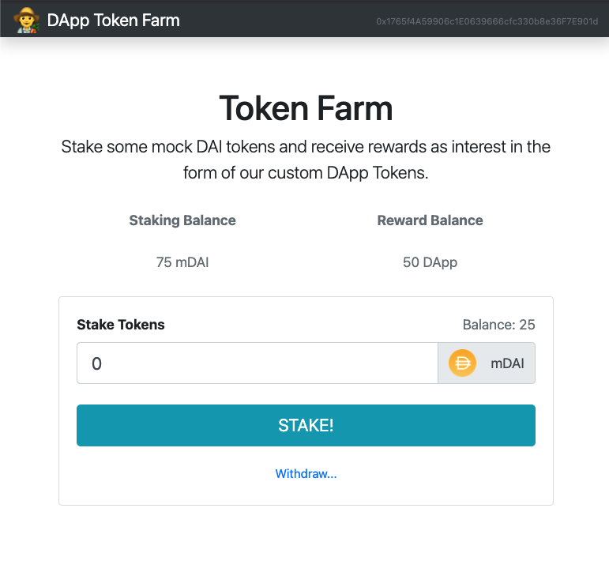

# Defi Yield Farm

This is a decentralized yield farm built on the Ethereum blockchain.  The application allows users with Ethereum wallets to stake (deposit) mock DAI tokens in exchange for receiving rewards in the form of a custom ERC-20 "DApp Token", a custom token which represents this reward.  The investor can also withdraw their money at any time.

---

## Tech Used

### Backend

- Solidity for smart contracts - [Solidity](https://soliditylang.org/)
- Truffle development framework - [Truffle](https://www.trufflesuite.com/)
- Ganache blockchain network - [Ganache](https://www.trufflesuite.com/ganache)
- MetaMask Chrome extension - [MetaMask](https://metamask.io/)

### Frontend

- React.js - [React](https://reactjs.org/)
- ES6 Javascript

---

## Photos

